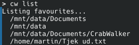
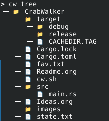

#+TITLE: Readme

* Table of contents :toc:
- [[#about][About]]
- [[#prerequisites][Prerequisites]]
- [[#features][Features]]
  - [[#favourite][Favourite]]
  - [[#navigation][Navigation]]
  - [[#autocomplete][Autocomplete]]
  - [[#tree][Tree]]
  - [[#piping][Piping]]
  - [[#edit][Edit]]
  - [[#list-dir][List Dir]]
- [[#commands][Commands]]
- [[#improvements][Improvements]]

* About
A Cli tool written in rust to make navigation more fun, and perhaps quicker.
It can seamlessly integrate with Unix piping so that it doesn't get in the way of the user.
Its made to explore the capabilities of clap and for my own needs in my day to day terminal uses.

* Prerequisites
- Nerdfont to show icons in tree view.
- The shell wrapper from the repository in.
  #+begin_quote
  ~/.config/crabwalker/cw.sh
  #+end_quote
- Source the shell wrapper in '.bashrc'.
  #+begin_quote
  source "$HOME/.config/crabwalker/cw.sh"
  #+end_quote
- Bash shell.

* Features
All files are kept in:
#+begin_quote
~/.config/crabwalker/
#+end_quote
It includes, Favourite list, State list and shell wrapper.

** Favourite
The favourites are a static list.
We can add, remove and list favourites.
List example:

Favourites can also be a file, if we "cd" to a file we land in the directory that contains it, it doesn't open at once, this is to keep piping safe.
** Navigation
The tool focuses on static favourites as a way to get around quickly.

Then to "cd" into another directory, if a favourite is added, we can:
#+begin_quote
cw "favourite"
#+end_quote
The tool will always look for a favourite before resolving a potential path.

At the same time, whenever we change directory using "cw" a state(stack) is kept.
That means we can use "back" to jump back to where we were.
We can also list the 10 last states:

** Autocomplete
There is autocomplete for paths, which is handled by the shell and shell wrapper.
Autocomplete for favourites are handled in the rust code.
** Tree
To get a god sense of what folder structure we are currently in, or on the way to, we can use the Tree command.
It lists the directory structure in a pretty way to give an overview:

The depth can be controlled beyond the default value.
** Piping
The tool is safe for Unix piping. That mean we can for example use it together with "fzf":
#+begin_quote
cw "$(cw list | fzf)"
#+end_quote
To show or favourites list, select with fzf and jump to it.
This works with:
- Tree
- Back
- List
for navigation.
It can also be used together with the "edit" command to edit a favourite for example:
#+begin_quote
cw edit "$(cw list | fzf)"
#+end_quote
** Edit
Edit is added to give extra flexibility to files in the favourites, to quickly get to editing a file, that is often used.
Edit wont work on folders.
It uses the "$EDITOR" and defaults to nano.
** List Dir
Run the application with no subcommands to list files and folder in current dir
#+begin_quote
cw
#+end_quote
the "-a" flag can be used to show hidden files and folders.

* Commands
The usage of the tool is as follows.
#+begin_quote
cw [TARGET] [COMMAND]
#+end_quote
Where target can be a Path or a Favourite.
- Path
  cd to path or favourite.
- No Command
  Show current directory contents
  - a
    Shows hidden
- List
  List all favourites.
- Up
  Jump up to parent directory
- Edit
  Edit file from path or favourite.
- Add
  Add path to favourites.
- Remove
  Remove favourite.
- Tree
  Show directory tree in current directory.
  - path
    Show tree in path.
  - depth
    Control depth of folders shown.
  - entries
    Control maximum entries in folders.
  - hidden
    Show hidden files.
- Back
  cd to previous location.
  - number
    Jump back "n" times to a location.
  - list
    List last 10 states.
- Help
  Show help for using the tool.

* Improvements
- Learn most used paths and replace or integrate with static favourites.
  - Could implement a sort of machine learning for this.
- Implement interactive lists to hotkey to paths.
- Handle privileges (crashes) when access denied.
- More flags for the tree view ('.gitignore', symlinks and more)
- Maybe integrate fzf more deeply to have a command, to list things with fzf, pipe internally.
